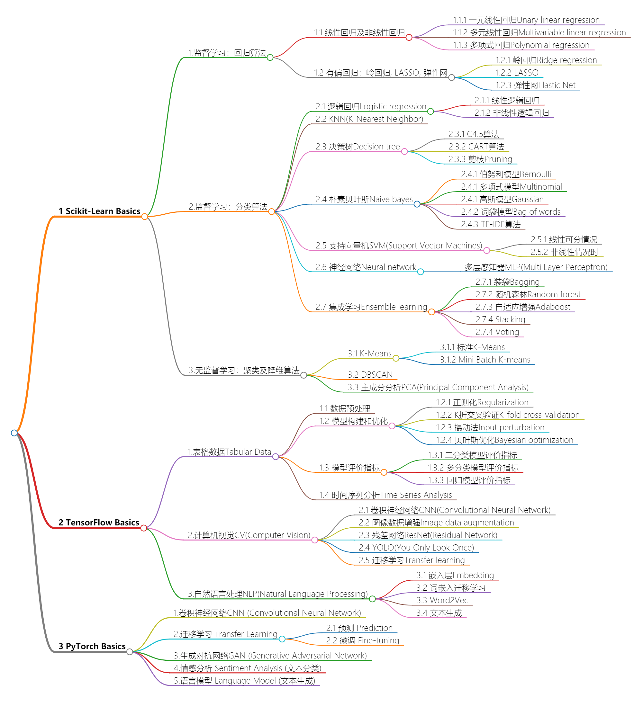

# Machine Learning Basics 

```python 3.7.4``` ```scikit-learn 0.22.1``` ```tensorflow 2.2.0``` ```tensorflow-hub 0.8.0``` ```torch 1.5.1``` ```torchtext 0.6.0``` ```torchvision 0.6.1``` 

#### Interactive structure is available at: https://basics.shangjielyu.com/


